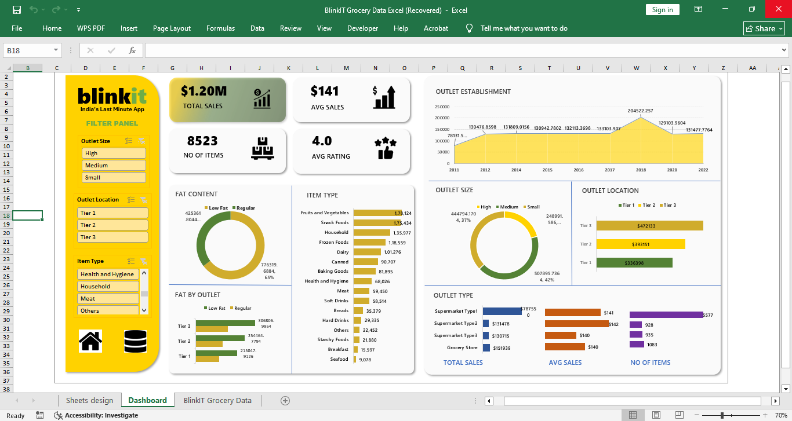

# Retail Intelligence & Operations Dashboard

## Project Overview

This project analyzes grocery retail sales data using Microsoft Excel to identify sales trends, outlet performance, product demand, and regional sales patterns. An interactive dashboard was developed to transform raw data into actionable business insights.

## Business Objective

The objective of this project was to:

* Analyze sales performance across products and outlets.
* Identify high-performing product categories.
* Evaluate outlet performance by location and size.
* Generate business recommendations for growth.

## Tool Used

* Microsoft Excel

## Excel Features Used

* Pivot Tables
* Pivot Charts
* Slicers
* Conditional Formatting
* KPI Cards
* SUM, AVERAGE, COUNTIF, SUMIF

## Key Performance Indicators

* Total Sales
* Average Sales
* Number of Items Sold
* Average Customer Rating

## Key Insights

### 1. Low Fat Products Generated Higher Sales

Customers showed a stronger preference for low-fat products.

### 2. Fruits & Vegetables Were Top Performing Categories

These categories contributed significantly to total revenue.

### 3. Tier 3 Locations Generated Highest Sales

Tier 3 outlets outperformed other regions in terms of revenue.

### 4. Medium-Sized Outlets Performed Best

Medium-sized outlets generated higher sales compared to small and large outlets.

### 5. Supermarket Type 1 Generated Highest Revenue

This outlet format was the strongest contributor to sales.

## Business Recommendations

* Increase inventory for high-performing products.
* Expand in Tier 3 locations.
* Focus on medium-sized outlets.
* Promote low-fat product categories.

## Skills Demonstrated

* Data Cleaning
* Data Analysis
* Dashboard Development
* KPI Reporting
* Data Visualization
* Business Intelligence

## Dashboard Preview

## Project Outcome

The project demonstrates how Microsoft Excel can be used to transform raw business data into meaningful insights that support data-driven decision making.

## Author

**Sneha Mandlik**
Fresher Data Analyst | Python | SQL | Power BI | Excel | Mumbai

[LinkedIn](https://www.linkedin.com/in/sneha-mandlik-29431b24a/) · [GitHub](https://github.com/SnehaMandlik)
